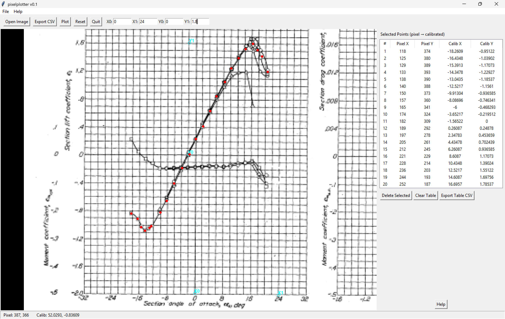

# pixelplotter

gui python tool for generating tabular data from images

Neal Gordon  

shamelessly generated with copilot

example of usage


install dependencies
```
conda install -c conda-forge opencv pillow matplotlib -y
```

to compile to exe, this might work (i havent tested it)
```
pyinstaller --noconfirm --onefile --windowed pixelplotter.py
```
